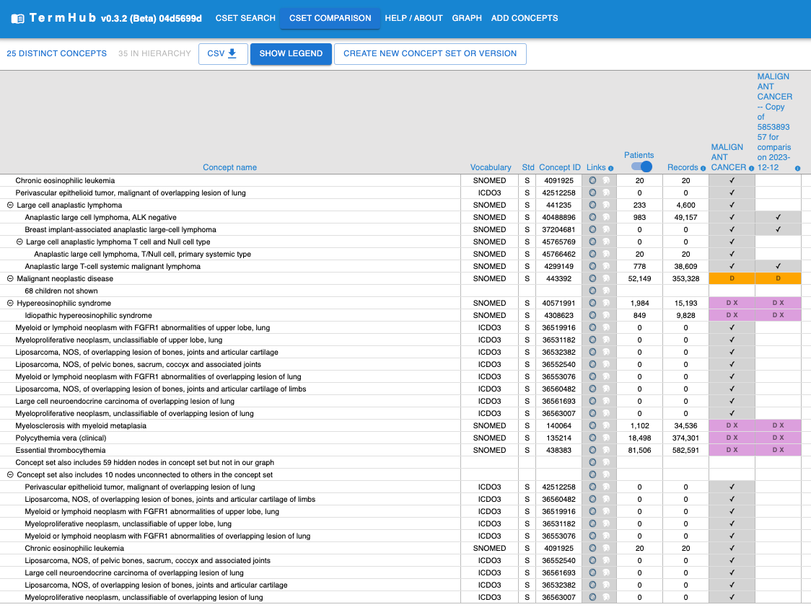
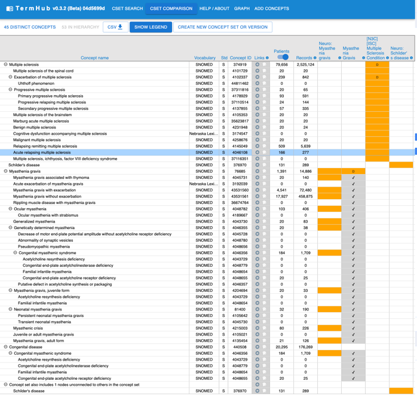

## Test cases

#### TODO: fix all this. still working on malignant cancer and need jest tests

#### [MALIGNANT CANCER](http://localhost:3000/cset-comparison?codeset_ids=585389357&codeset_ids=1000003793)
- Have this reviewed before 2/9 friday meeting
- 585389357 v2.0, vocab v5.0 09-APR-22; 1469846 pts, **53510** concepts, flags: D: 1, DX: 5
- 1000003793 v1.0, vocab v5.0 31-AUG-23; 0 pts, 53993 concepts, flags: D: 1, DX: 5
- 53K concepts
- [First graph.py](#first-graphpy): takes long time on server (minutes) and crashes browser
- [Connects root nodes](#connects-root-nodes): Hoses server; gave up after close to an hour waiting for backend results.
- [Small to large subset search for common ancestors](#small-to-large-subset-search-for-common-ancestors):
  
- [Minor changes](#minor-changes-i-think): about 20 seconds on server, but data is wrong --
- [Backwards DFS](#backwards-dfs):
  - Graph construction and gap filling is quite fast, but `get_indented_tree_nodes` takes a
    very long time. It does finish, though, and gives a lot more concepts. But even if I add
    up all the hidden children and all the concepts (which will certainly have some double
    counting), it still comes out to around 12K, which is a lot less than 53K.
  - Stepping through backend, before calling `get_indented_tree_nodes`, sg has
    55K concepts; so it must be `get_indented_tree_nodes` that's losing concepts.
    Maybe the gap filling algorithms have been working? The newer one seems better,
    but we might want to do some testing and comparison across algorithms.

#### [Many small -- neurological](http://localhost:3000/cset-comparison?codeset_ids=1000002657&codeset_ids=241882304&codeset_ids=488007883&codeset_ids=1000087163)
- [First graph.py](#first-graphpy)
    - Multiple sclerosis (374919) appears twice; identical except Myasthenia gravis (76685)
      is (sort of) indented below the second one.
      
- [Connects root nodes](#connects-root-nodes)
    - 
- [Minor changes](#minor-changes-i-think):
  - Multiple sclerosis (374919) unnecessarily duplicated. Apparently Schilder's disease
    would have been an orphan except for including common ancestor with Multiple sclerosis;
    but included too many common ancestors and second copy of Multiple sclerosis appears
    unnecesarily under another ancestor with no other children.
    
- [Backwards DFS](#backwards-dfs):
   (commit hash on the screenshot is wrong)

#### [CEREBROVASCULAR DISEASE](http://localhost:3000/cset-comparison?codeset_ids=718894835&codeset_ids=1000017855)

#### [CARDIOMYOPATHIES](http://localhost:3000/cset-comparison?codeset_ids=35275316&codeset_ids=1000062292)
  - 35275316 v3.0, vocab v5.0 22-JUN-22; 455,285 pts, 6,702,050 recs, 199 concepts, flags: D: 2, X: 1
  - 1000062292 v4.0, vocab v5.0 31-AUG-23; 0 pts, 8,081,456 recs, 199 concepts, flags: D: 2, X: 1
  - 12 removed, 12 added

## Commits of interest

### Backwards DFS
_[c18773b6](https://github.com/jhu-bids/TermHub/commit/c18773b6)_ 2024-01-25
- See [diagram](https://github.com/jhu-bids/TermHub/blob/develop/docs/graph.md#gap-filling)

### [Minor changes, I think](https://github.com/jhu-bids/TermHub/compare/194b52c9..29ce57d)
- Base case for `tst_graph`: _[29ce57d](https://github.com/jhu-bids/TermHub/commit/29ce57d)_ 2024-01-08;
  no graph algorithm changes in these subsequent commits.
- _[29ce57d2](https://github.com/jhu-bids/TermHub/commit/29ce57d2)_ 2024-12-08
- _[51bf3851](https://github.com/jhu-bids/TermHub/commit/51bf3851)_ 2024-01-10
- _[5f80bfba](https://github.com/jhu-bids/TermHub/commit/5f80bfba)_ 2024-01-18

### [Simplified version](https://github.com/jhu-bids/TermHub/compare/7adafa3c..194b52c9)
_[194b52c9](https://github.com/jhu-bids/TermHub/commit/194b52c9)_ 2023-12-18
- made simplified version of `connect_nodes`. definitely different output
  on some csets (not all). neither is correct though. i wonder if an
  earlier commit has better results
- added all the tests to the `graph_tst` csv

### [Not sure; haven't inspected](https://github.com/jhu-bids/TermHub/compare/708ee558..7adafa3c)
_[7adafa3c](https://github.com/jhu-bids/TermHub/commit/7adafa3c)_ 2023-12-15
- There was a problem with indented trees sometimes coming out huge
  even when the graphs were smallish. Fixed it. Stephanie had been
  having a problem with browser crashing or hanging a long time with
  https://icy-ground-0416a040f.2.azurestaticapps.net/cset-comparison?codeset_ids=1000057038&codeset_ids=477016825&codeset_ids=633531393
  which should be fine now

### [small_graph_threshold tweaks](https://github.com/jhu-bids/TermHub/compare/04d5699d..708ee558#diff-c98c490c3ff03167df87266a76886ca4b398141c13b02a66999e71ec45c889d7)
- _[708ee558](https://github.com/jhu-bids/TermHub/commit/708ee558)_ 2023-12-15
  - On 2024-01-11, this is the commit deployed on dev

### Small to large subset search for common ancestors
- [Significant refactor](https://github.com/jhu-bids/TermHub/compare/89863ba9..04d5699d#diff-c98c490c3ff03167df87266a76886ca4b398141c13b02a66999e71ec45c889d7)
- _[04d5699d](https://github.com/jhu-bids/TermHub/commit/04d5699d)_ 2023-12-14
  - On 2024-01-11, this is the commit deployed on prod
  - The Example comparison on the
    home page was taking forever to run. I figured out
    that I was doing part of the finding common ancestors
    algorithm backwards and now it's very fast.

### [Factored `get_connected_subgraph` out of `indented_concept_list`](#factored-get_connected_subgraph-out-of-indented_concept_list)
- _[72de8603](https://github.com/jhu-bids/TermHub/commit/72de8603)_ 2023-12-13
  - Got rid of raise error on get_unrooted_children in connect_nodes
    because it does find unrooted children
  - In concept_graph_post, replaced fill_in_gaps with get_connected_subgraph

### [Minor changes from Connects root nodes](https://github.com/jhu-bids/TermHub/compare/9f6f82b..89863ba9)
- _[89863ba9](https://github.com/jhu-bids/TermHub/commit/89863ba9)_ 2023-12-04
  - For [Many small -- neurological](#many-small-neurological) identical output to Connects root nodes, but graph.py code is
    somewhat different. May be worth testing this on other cases.

### Connects root nodes
- _[9f6f82b](https://github.com/jhu-bids/TermHub/commit/9f6f82b)_ 2023-11-13
- Creates a subgraph from g using nodes. Identifies root and leaf nodes in this
  subgraph. Generates all simple paths from each root to each leaf in the original
  graph g. Returns the list of all such paths.
- From commit message:
  - Totally redid subgraph generation and now downloading indented concept
    list instead of constructing it on the front end based on creating a
    front-end graph based on subgraph edges from backend. Seems to work,
    but collapse is broken now...maybe other stuff too.
  - No longer need an undirected version of the graph
  - Expanded to include all 'Is a' relationships from `concept_relationship`
    table in addition to `concept_ancestor` where min separation = 1 already
    included. [switched back at some later time]
- In order to get this to work, I had to turn off api_logging (which I've now
  added to the patch file.)
  Tested with:
- [MALIGNANT CANCER](#malignant-cancer) (fails)
- [Many small -- neurological](#many-small-neurological) (seems fine)

### ~~_[7c6b78b](https://github.com/jhu-bids/TermHub/commit/7c6b78b)_ 2023-06-26~~
~~Working on caching. Maybe no substantive change since 05-16, but graph.py is
stable. Apparently no change in algorithm until 11-13.~~
Should be same algorithm as above, but can't get this one working. Too many package
issues.

### First graph.py
- _[eb27fa7](https://github.com/jhu-bids/TermHub/commit/eb27fa7)_ 2023-05-16
- First appearance of graph.py. There's important stuff to look at
  before this, but can't get older ones working.
- Uses cr-hierarchy, which calls connected_subgraph_from_nodes. Method
  is to use undirected graph to connect pairs of root nodes
  and construct tree on front end.
- <code style="color : gold">A week or two later (a5ae636c) added
  `sort_by_most_descendants`, which I think is gone now. Might want
  to add it back in.</code>