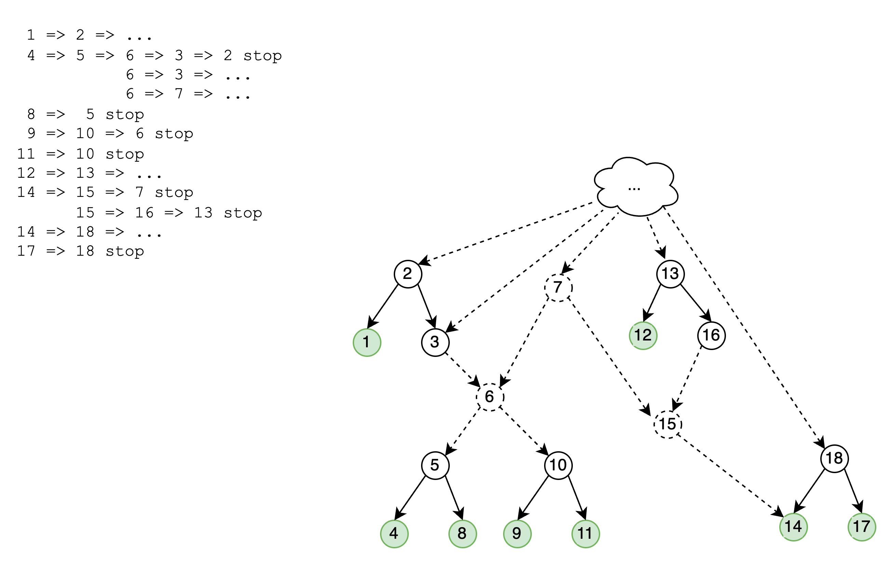
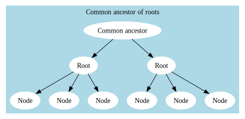
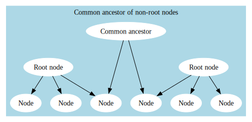

# Documentation about vocabulary hierarchy algorithms and display
## Terminology
**Expansion set**: Set of concepts/nodes in the concept set expansion, including any nodes in the definition that were
not marked as excluded. _Filtered expansion set_ means after filtering out certain vocabs (e.g. RxNorm extension).
I think this is the set of all of the nodes we ultimately want to display, with the exception of _missing in-betweens_,
which we will find and add later.

**Missing in-betweens**: (i) Concepts that were not included in the original expansion at the time of the OMOP
vocabulary version when the cset definition was created, but do show up in expansions in subsequent versions. (ii) When
creating a single graph for more than 1 concept set, these are concepts that would exist in between any connecting paths
between these concept sets.

**Final/display hierarchy/graph**: The hierarchy / subgraph that object that wil be displayed in the browser.

**Final/display node set**: All of the nodes in _final/display hierarchy/graph_.

**Nodes of interest (deprecated?)**: I think Siggie originally came up with this term but I don't know if they are still
using it. I think we should deprecate because it is ambiguous. "Of interest" means different things in different
situations. This could be (a) all of the as all of the concept set members after expansion. Includes orphans if they are
part of those concept set members. Or (b), 'a', minus concepts from filtered out vocabs (e.g. RxNorm Extension). It
could also be (c) 'b', plus any missing in-betweens we'd find later.

**Preferred nodes**: TODO

## Graph display for hierarchical table of concepts

### Requirements
1. **Create hierarchy**: Display hierarchical list of all concepts of interest  
  - **Concepts of interest**: in codesets of interest, possibly others found by search or vocab nav (@Sigfried 1/24 can you 
eleborate on that?).
  - **Filter vocabs**: Filter out concepts from certain vocabs, e.g. RxNorm extension
  - **Show only n concepts**: Limit number of concepts displayed to help w/ performance
  - **Add missing in-betweens**
  - **All concepts from multiple csets in single hierarchy**
2. **Performance**
   - Within specific time (e.g. <20 seconds for even largest csets)
   - Backend, frontend, user experience
      - Dynamic hide/display to allow for large sets of concepts
3. Ordering of nodes
   - sibs: E.g. alphabetical, n descendants, patient/record counts
4. Caching
  - Should we cache the hierarchy of every cset by itself?
  - Should we cache some popular comparisons as well?
  - Cache most/all comparisons users request
  - For each cset/comparison, cache for multiple vocabularies?
  - For each cset/comparison, cache multiple levels of hiddenness?
    - Default level of hiding (e.g. 2k concepts)
    - Full tree, perhaps depending on how many cocepts
    - Before/after hiding vocabs (e.g. RxNorm Extension)
    - Pre-made buckets?: e.g. 2k, 4k, 6k, etc, rather as alternative to mechanism to arbitrarily show/hide beneath a single node

### Algorithm
Input params:
   - `codeset_ids: List[int]`
   - `concept_ids: List[int] = None`  (optional)
   - more parameters:
     - `vocabs_to_hide: List[str] = None`
     - other stuff to hide
     - `maximum_depth: int`
     - `maximum_nodes: int`
     - ...
1. Transform `codeset_ids` to `concept_ids`...
2. Get networkx subgraph object
  - This will consist of disconnected 'components' that we have to connect through gap filling.
3. Find all roots
4. Any steps in between?
5. Gap filling
6. Hiding concepts by filtered vocab
7. Hiding: dynamic subtree
  - Display only n (~2,000) nodes

#### Algorithm considrations
- Should "Hiding concepts by filtered vocab" come towards the beginning, or towards the end?

#### Gap filling 
**Description**
Fill in gaps where included concepts are descendants of others but in-between nodes are not included. That is, if we 
have unconnected graph, separate components, we would like to find if there are nodes in the graph that would connect 
them. But now (unlike previous versions), we don't want to find ancestors of root nodes to connect stuff.

Live diagram: https://app.diagrams.net/#G1mIthDUn4T1y1G3BdupdYKPkZVyQZ5XYR

Outdated

> [!WARNING]  
> TODO: The part in 'Outdated' below is incorrect and out of date, and either (a) needs to be updated to reflect the current code, or (b) discarded completely. Originally Joe had created an algorithm to do things differently, where we identify the leaf nodes and then construct a hierarchy all in one go, including the missing in-betweens. But what we went with instead is (i) create a partially disconnected graph consisting of only the nodes in the expansion, (ii) gap fill.

**Input params**
- `leaf_nodes: Set[Node] `: IDK if this is as simple as using a pre-existing `networkx` or if it requires more coding on
our part. Siggie probably already knows how to do this.
- `expansion_set: Set[Node]`: See: _expansion set_ in 'terminology' section at top. I think this will be the same nodes 
as the as `concept_ids` that are passed to or created in the general _Algorithm_.

**Returns**
- `graph: Graph`: The resulting graph / hierarchy.
- `missing_in_betweens: Set[Node]`: Or `Set[int]` if it suffices just to have the `concept_id`. I'm not sure if this 
will be needed for the rest of the Python algorithm, or will simply be returned to JS in order to display these
differently. 

**Declare variables**
- `components: Dict[int, Graph]`, where `int` is the `Node.id` of its root, or some arbitrary number. I think this will 
consist of networkx Graph objects? I may be totally wrong here,
but the way I see this algorithm working is that we start with 0 subgraph components. As we traverse leaf nodes and hit
roots, we will have built a component, and we add it to this list. As we progress, we'll be connecting and merging these
until at the end we've connected everything and there is only 1 subgraph component left, and that is our finished
hierarchy.
- `nodes_traversed: Set[Node] = set()`: This is all of the Node in all of the subgraphs in `components`. We only need to
add entries to this once determined we are done creating a component and are adding it to `components`. This will be
used later to check if we've already traversed a node so that we don't do so again.

**Algorithm**  
`for node in leaf_nodes`:  
  - for each `node`'s parent nodes `n`:  <-- this needs to be a recursive function  
    - I think we need to store the path as we are recursing here. I guess we could be building up a Graph object, in which case we could call this 'component'. That 
    would be better if we can. But if not then I guess this would be a `List[Node]` .
    - `if n in nodes_traversed:`  
      - I think here we need to connect this path to an existing graph in `components`, because we don't need to 
      traverse any further. If the 'path' that we've been building up is not already a Graph object, we need to convert it too one. 
      If it can't be connected to any graphs in `components`, it needs to be added to it. The dictionary key would be the ID of its root node.
      - `node_component_lookup`
      - `continue`
    - Otherwise this will keep going until we hit the top of the hierarchy: and can't go any higher, we need to figure out what part of the path needs to
    be discarded. So we descend back down until we find the first node that is in our expansion_set. We discard 
    everything above that. And below and including that, we save this subgraph object by adding to `components`. 
    - `if node not in expansion_set:` `missing_in_betweens.add(n)`  
    - `nodes_traversed.add(n)`  
    - Recurse: _for each `node`'s parent nodes `n`:_

Somehow at the end we have to combine any remaining uncombined subgraphs in `components` into a single graph.

ideas 2024/01/24 ~11am _(I don't know if these are still relevant after coding up the above psuedo code algorithm so leaving here)_:
   - Find path between each node and all the nodes in other components -- will probably be too slow
   - If node has descendants=True, its descendants should already be connected to anything the root
     is connected to -- **except** if vocabulary has changed and connecting nodes have become non-standard
     and no longer show up in the concept_ancestor table and therefore in graph. This could be fixed if
     we use the original vocabulary the concept set was expanded with.
   - Could make combined vocabulary with edge attribute of bit string representing which vocab versions the edge exists in
   - Traverse from each node through predecessors (parents)....?
   - Missing in-betweens: is it possible to find them before gap filling?

 

#### Hide nodes (Dynamic subtree)
[Dynamic subtrees (collapsing many lines to one) #602](https://github.com/jhu-bids/TermHub/issues/602)

Crux of algorithm:
1. **Hide deepest layers 1 at a time**: E.g. hide anything below 7 levels down, then 6, etc, until at or below threshold
(e.g. 2k concepts).
2. **Unhide until at threshold**: Step (1) will likely almost always result in overshooting, e.g. resulting in only 
displaying <2k concepts. We want to then ideally increase this concepts until get to threshold, e.g. by unhiding 
subtrees / nodes 1 at time until at threshold.

### Edge cases
@Sigfried 1/24 this section might be outdated now but I wans't sure what to remove.

The code for filling in gaps in concept subgraphs and displaying them as trees has never worked quite right -- though it usually is or seems right enough for people not to notice. But there have been a wide variety of edge cases like
- The gaps aren't filled in correctly
- Unneeded ancestors are added
- The subgraph gap-filling or backend tree construction takes so long that it hangs
- There's so many indented tree nodes that the browser slows to a crawl or crashes

I'm realizing again that there are problems in the algorithm, so I'm going to use this space to try to plan out and
document a new algorithm. This will be based on [graph testing](./graph-testing.md).

## Graph visualization
I'd like to make a few test cases that include all the various edge cases that have to be handled. At least one small one that can be manually tinkered with and easy to understand and some big ones made with real data for testing front/back end performance and manageability and summarization features (collapsing many nodes into an expandable summary node.)

I would like to be able to use [graphviz and dot](https://graphviz.org/) for authoring and graphically rendering the small use cases, but it has a weird architecture. It has APIs, declarative language, CLIs, and stuff; but they rely on [executables](https://graphviz.org/download/) which are environment-specific. (See stack overflow for [how to handle azure](https://stackoverflow.com/questions/76244214/how-to-fix-pygraphviz-program-dot-not-found-in-path-error-in-azure-or-gcp).)

## Old
This is to answer @joeflack4's questions on https://github.com/jhu-bids/TermHub/pull/611 and will also
be useful for documenting future work on managing vocabulary data and display, which will get complex
when we start breaking it down into smaller pieces. See [issue 611](https://github.com/jhu-bids/TermHub/pull/611)
and [octopus notes](https://github.com/trberg/Octopus/blob/master/Notes.md#oct-6-2023----requirements-for-multiple-concept-set-display-and-dynamic-subtree-summarization-and-loading) (also pasted in below.)

## Explanation of new concept hierarchy algorithm
[Code is here](https://github.com/jhu-bids/TermHub/blob/fixing-concept-hierarchy/backend/routes/graph.py#L43C1-L137C1)

As an example, we can look at the first 12 lines of [this concept set comparison](https://icy-ground-0416a040f.2.azurestaticapps.net/cset-comparison?codeset_ids=817711041&codeset_ids=1000020459):

call `all_paths`, which finds all simple paths from every root node (no parents) to every leaf node (no children);
the first four rows of its return account for the indented concept list shown above.

    [37312530, 761858]
    [37312530, 36712805, 35611566]
    [37312530, 36712807, 35611566]
    [321052, 3654996, 37110250, 46271459, 761430, 761858]

But rather than return those full paths, we call `paths_as_indented_tree(paths)`, which converts the paths
to this simpler structure for easy tabular display:

    (0, 37312530)
    (1, 761858)
    (1, 36712805)
    (2, 35611566)
    (1, 36712807)
    (2, 35611566)
    (0, 321052)
    (1, 3654996)
    (2, 37110250)
    (3, 46271459)
    (4, 761430)
    (5, 761858)
    (5, 761431)

## Eventual goals for vocabulary / concept set display and data management

Oct 6, 2023
1. Moving towards controlling data collapse/fetch from our own data module
   instead of operating on the d3-dag data structure
2. Talking through data and display ideas
3. For multiple concept sets, show the list, and when you hover over
   a node, highlight the concept sets that contain it.
4. Have check boxes for each concept set and highlight all the nodes that
   are contained by all the ones checked (partial highlight if not all
   descendants are contained.)
5. If a node has x (10?) or more children, try to keep it collapsed, but allow
   user to see what's in it: 1) by size/color; 2) with a list that appears on
   hover or click;
6. Showing a lot with each node: 
   - number of children
   - whether all or some children/descendants belong to concept sets
   - how deep it goes
   - easy access to names of children
7. What about multiple relationship types? Mapping, body site, causes, etc.
   - Could show collapsed nodes as children, one for each relationship type
8. If user has a lot of nodes displayed (and many more in memory), and tries
   to expand something big: prompt them to collapse something else?
   - Maybe it's temporary message for a few seconds: "You're displaying a lot of
     nodes. The application may become slow. Do you want to collapse something else?"
   - Or message, how many nodes in memory and displayed.
   - And how many descendants/levels
9. Server should provide number of descendants/levels for nodes first
   and then provide the actual nodes for them either on demand or, if
   resources available, on prefetch
10.Slider for the user to balance between performance and data density
